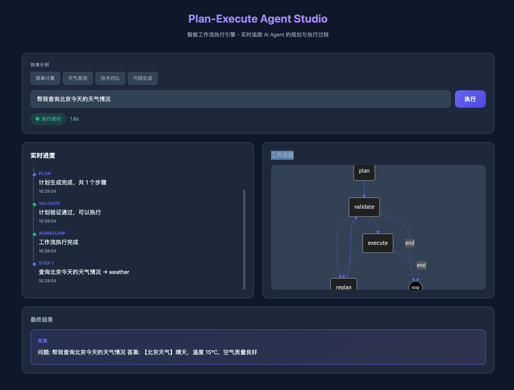

# langgraph-agent-plan-execute
该项目主要探索 langchain4j 和 langgraph4j 的部分使用方法，实现一个可以自动运行的 agent，该 agent 需要满足以下条件：
1. 支持动态加载模型。
2. 支持动态配置工具列表, 目前的工具列表可以配置在数据库中。
3. agent 执行前，制定可行的计划
4. agent 检查执行计划的可行性，当可执行时，执行计划，当不可行时，重新执行计划。



```shell
CHAT_BASE_URL=https://127.0.0.1:8000/v1
CHAT_MODEL=qwen-plus
CHAT_API_KEY='xxxxxxx'
EMBEDDING_MODEL=bge-m3

LANGCHAIN_CHAT_LOG_REQUEST=true
LANGCHAIN_CHAT_LOG_RESPONSE=true


```
